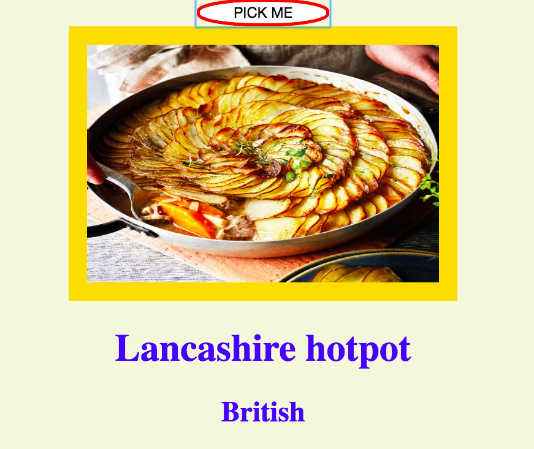

# FoodExpress
Express application using a food api and making a platform for users to share their views and agree or disagree.

## How It's Made:

**Tech used:** HTML, CSS, JavaScript, MongoDB, Express

I combined an old food API i once used with an express I had to allow a User to press a button get a random recipe and origin country. From there the user can add a comment or memo about the recipe and other users either agree or disagree with the statements made about the recipe.

## Lessons Learned:

Had an awesome time figuring out to put the api into this express application. After this this i was just placing the coreect click events and endpoints and then my finished product enjoy!!!
